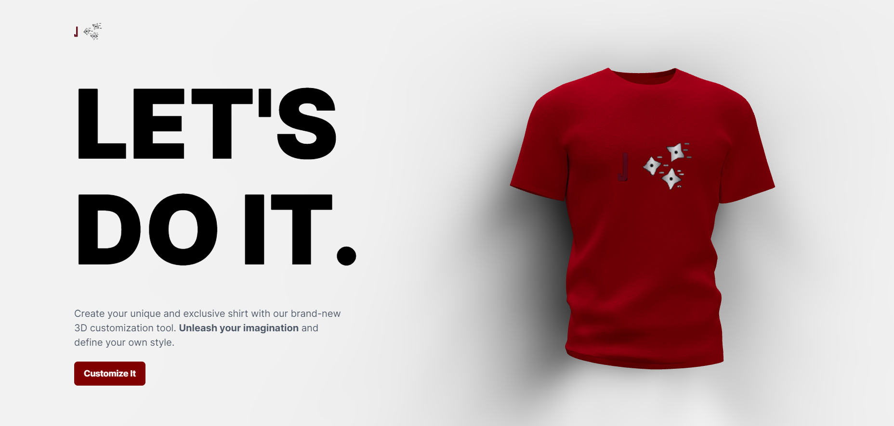

# Jays-3D-Ai-Shirt-Designer
This is a web application that allows users to customise shirts using a 3D AI model. The application is built using Vite, React, ThreeJS, Express, Tailwind, and Valtio. To view this, please visit 

## Getting Started
To get started with the project, clone the repository to your local machine:
git clone https://github.com/7Jay-Lee7/3d-ai-customizing-shirt-website.git

Then, navigate to the client folder and use npm install and then the same with the server folder.

Once you have done this, you will need to go to [OpenAi](https://platform.openai.com/account/api-keys) and get yourself an API Key.

Then add this to the .env.example file and then rename the file to just .env.

## Running the Application
To run the application, start the server:
npm start
This will start the Express server at http://localhost:8080.

Then, start the client:
npm run dev
This will start the Vite development server at http://localhost:5173.

## Building the Application
To build the application for production, run:
npm run build
This will build the client and server code and output it to the dist directory.

## Technologies Used
This application uses the following technologies:

* Vite: a build tool that provides fast development server and optimized builds.
* React: a JavaScript library for building user interfaces.
* ThreeJS: a JavaScript library for creating 3D graphics in the browser.
* Express: a Node.js web application framework.
* Tailwind: a utility-first CSS framework.
* Valtio: a state management library for React.

### Contributing
If you would like to contribute to the project, please open a pull request with your changes.

### License
This project is licensed under the MIT License. See the LICENSE file for details.
